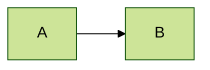
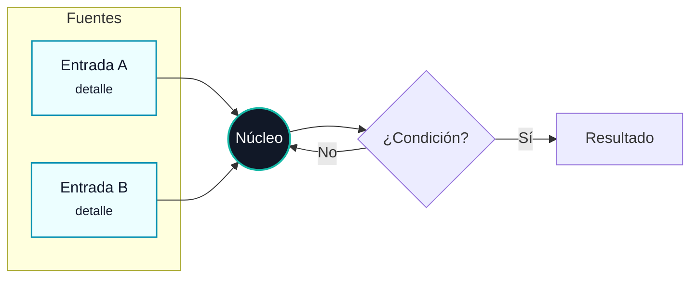

# Diagramas Mermaid en posts

Los diagramas se escriben **dentro del Markdown del post** como bloques
` ```mermaid ... ``` `. No se editan en HTML ni JS: `js/post.js` los detecta,
los envuelve en `<figure class="post-diagram">` y los inicializa **después** de
cargar el Markdown. Mermaid 10 llega por CDN en [post.html](../../../post.html).

Úsalos solo cuando aporten (flujos, modelos, relaciones, decisiones). Para datos
tabulares o listas simples, prefiere texto/tablas.

## Cómo se renderiza (no lo rompas)

- Carga: `js/post.js` → `renderMermaidDiagrams()` busca `pre code.language-mermaid`,
  reemplaza el `<pre>` por un `<figure class="post-diagram">` con un
  `<div class="mermaid post-diagram__canvas">` y llama `mermaid.run(...)`.
- Render **aislado por diagrama**: `js/post.js` recorre cada bloque, elige su
  tema y lo dibuja con `mermaid.render`. `securityLevel: 'loose'`,
  `flowchart.curve: 'basis'`, `htmlLabels: true` aplican a todos.
- **Tema por diagrama:** el predeterminado es `base` con la paleta del sitio
  (grises/teal/ámbar suaves). Puedes elegir otro tema **dentro del bloque**.
- Responsividad: `.post-diagram` (en `css/styles.css`) centra, limita el ancho a
  `min(960px, 100vw-2rem)`, da `overflow-x: auto` y el canvas tiene `min-width`
  (760px / 680px en móvil). El SVG se escala a `width:100%`. No añadas estilos
  inline de tamaño al SVG.

## Reglas de estilo (de AGENTS.md)

- Visualmente moderno, legible y **responsivo**.
- Nodos **etiquetados**, agrupación clara (`subgraph`), colores **contenidos**.
- Encabezado descriptivo encima del bloque, p. ej. `### Diagrama del modelo`.
- Mantén el diagrama simple: pocas ramas, etiquetas cortas. Usa `<br/>` y
  `<small>…</small>` para subtítulos dentro de un nodo (htmlLabels está activo).

## Elegir el tema del diagrama

`js/post.js` lee el tema **de cada bloque** y lo renderiza aislado, así que
distintos diagramas del mismo post pueden usar temas distintos. Temas válidos:
`base` (predeterminado, con la paleta del sitio), `default`, `neutral`, `forest`,
`dark`. Si no indicas nada, se usa `base`.

Para fijar el tema, decláralo **dentro del bloque** con la directiva nativa de
Mermaid en la primera línea:

````markdown

````

Notas:
- Solo `base` aplica la paleta propia del sitio (`themeVariables`); los demás
  temas usan sus colores nativos (la tipografía Open Sans se mantiene en todos).
- Con temas que ya traen color propio (`forest`, `dark`, `neutral`) suele
  sobrar el `classDef`: deja que el tema pinte los nodos y úsalo solo para
  resaltar 1-2 elementos clave.
- El detector acepta cualquier mención `theme: <nombre>` en el bloque (directiva,
  frontmatter `config:` o un comentario), pero la directiva `%%{init}%%` es lo
  más legible y portable.

## Patrón recomendado (tema base, coherente con el post existente)

````markdown
### Diagrama del modelo


````

Paleta de `classDef` ya usada en el sitio (reúsala para consistencia):

- Señales/entradas: `fill:#ecfeff,stroke:#0891b2,color:#0f172a`.
- Nodo central/líder: `fill:#111827,stroke:#14b8a6,color:#ffffff`.
- Acción/positivo: tonos ámbar suaves (`#fff7ed` / `#ea580c`).

## Verificación (obligatoria)

Mermaid corre por `fetch` + JS, así que valida **por HTTP**, no abriendo el HTML.

```bash
python3 -m http.server 8001
```

- Abre `http://127.0.0.1:8001/post.html?p=<slug>` y confirma que el diagrama
  **renderiza como SVG** (no queda como bloque de código).
- Revisa que no haya errores de sintaxis Mermaid en la consola del navegador
  (si falla, `mermaid.run` lo captura y el bloque puede quedar vacío).
- Prueba en ancho móvil: el diagrama debe poder hacer scroll horizontal dentro
  de `.post-diagram` sin romper el layout de la página.
- Si hay automatización de navegador disponible, inspecciona el render.

## Límites

- No cambies el tema global ni `mermaid.initialize` en `js/post.js` salvo que se
  pida explícitamente (afecta a todos los diagramas del sitio).
- No introduzcas otra librería de diagramas.
