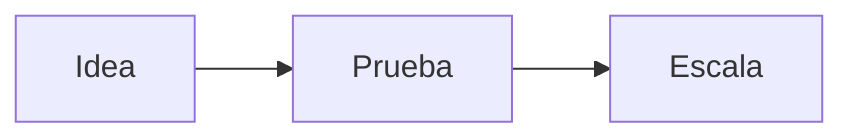

# Página personal y blog — Arnulfo Reyes

Sitio estático personal con blog en Markdown. Sin build tools, sin frameworks, sin backend: **HTML, CSS y JavaScript** servidos tal cual.

- Autor: Arnulfo Reyes
- Repositorio: <https://github.com/yosef7/personal-page-1>
- Licencia: [MIT](LICENSE)

---

## 1. Qué incluye

| Página | Archivo | Qué hace |
| --- | --- | --- |
| Inicio | `index.html` | Presentación, secciones de perfil y contacto |
| Sobre mí | `about.html` | Biografía y trayectoria |
| Blog | `blog.html` | Listado de publicaciones (se genera desde `posts/posts.json`) |
| Publicación | `post.html?p=<slug>` | Renderiza `posts/<slug>.md` en el navegador |
| Garage 164 | `garage164/` | Zona privada cifrada, sin enlaces desde el sitio ([detalles](garage164/README.md)) |

El blog **no se compila**: `post.html` es una sola plantilla que lee el slug de la URL, busca los metadatos en `posts/posts.json` y descarga el Markdown con `fetch`.

## 2. Stack

Todo se carga desde CDN, no hay `package.json` ni dependencias instaladas:

- **Bootstrap 5.1.3** + tema *Start Bootstrap – Clean Blog* (base de `css/styles.css` y `js/scripts.js`)
- **marked** — Markdown → HTML
- **Mermaid 10** — diagramas dentro de los posts
- **highlight.js 11.9** — resaltado de sintaxis (tema `atom-one-dark`)
- **MathJax 3** — fórmulas matemáticas
- **Day.js** — formato de fechas en el listado del blog
- **Font Awesome 6.1** y **Google Fonts** (Lora + Open Sans)

## 3. Estructura

```
.
├── index.html            # Inicio
├── about.html            # Sobre mí
├── blog.html             # Listado del blog
├── post.html             # Plantilla de artículo (?p=<slug>)
├── css/styles.css        # Estilos del sitio (incluye Bootstrap)
├── js/
│   ├── scripts.js        # Navbar y comportamiento del tema base
│   ├── blog.js           # Construye el listado desde posts/posts.json
│   └── post.js           # Carga el .md, Mermaid, highlight.js, MathJax y meta OG
├── posts/
│   ├── posts.json        # Índice de publicaciones (metadatos)
│   └── <slug>.md         # Contenido de cada publicación
├── assets/
│   ├── img/              # Imágenes de portada y de posts
│   └── *.ico             # Favicons
├── garage164/            # Zona privada cifrada (ver su propio README)
├── robots.txt            # Bloquea /garage164/ a los buscadores
└── _headers              # Cabeceras noindex/no-store para /garage164/*
```

## 4. Requisitos

- **Python 3** (para el servidor local) — viene preinstalado en macOS.
- **Node.js** — solo si vas a cifrar el vault de `garage164/`.
- Un navegador moderno y conexión a internet (las librerías vienen de CDN).

No hay `npm install`. No hay paso de compilación.

## 5. Levantar el sitio en local

```zsh
git clone https://github.com/yosef7/personal-page-1.git
cd personal-page-1
python3 -m http.server 8001
```

Abre <http://127.0.0.1:8001/>.

> **Importante:** no valides el blog abriendo los `.html` con doble clic (`file://`). `blog.js` y `post.js` usan `fetch`, que el navegador bloquea en el protocolo de archivos. Siempre por HTTP.

URLs útiles mientras trabajas:

| Qué revisar | URL |
| --- | --- |
| Inicio | `http://127.0.0.1:8001/` |
| Blog | `http://127.0.0.1:8001/blog.html` |
| Un post | `http://127.0.0.1:8001/post.html?p=escalar-sin-romper` |
| Garage 164 | `http://127.0.0.1:8001/garage164/` |

Para detener el servidor: `Ctrl+C`. Si el puerto está ocupado, usa otro (`python3 -m http.server 8002`).

## 6. Publicar una nueva entrada del blog

### Paso 1 — Escribe el Markdown

Crea `posts/<slug>.md`. El slug debe ser **corto, en minúsculas y con guiones** (`escalar-sin-romper`, no `como-escalar-sistemas-sin-romperlos-en-produccion`).

Todo post debe cerrar con:

```markdown
Gracias por leer mi publicación. Recibo con mucho agrado los comentarios y las críticas constructivas.
Me pueden encontrar en IG @arnulfo.
```

### Paso 2 — Consigue una imagen relevante

Busca una imagen sin marca de agua y de uso libre (Unsplash, Pexels, Pixabay) que **corresponda al tema del post**, no un genérico. Guárdala en `assets/img/` con un nombre claro, idealmente igual al slug: `assets/img/<slug>.jpg`.

### Paso 3 — Regístralo en `posts/posts.json`

Agrega el objeto al **inicio** del arreglo:

```json
{
  "slug": "mi-nuevo-articulo",
  "title": "Mi nuevo artículo",
  "subtitle": "Una descripción concreta y útil",
  "date": "2026-08-23",
  "author": "Arnulfo Reyes",
  "image": "assets/img/mi-nuevo-articulo.jpg"
}
```

| Campo | Obligatorio | Notas |
| --- | --- | --- |
| `slug` | Sí | Debe coincidir exacto con `posts/<slug>.md` |
| `title` | Sí | Directo, que comunique el valor práctico |
| `subtitle` | No | Concreto, sin frases infladas |
| `date` | Sí | Formato `YYYY-MM-DD`; ordena el listado de forma descendente |
| `author` | No | Por defecto “Arnulfo Reyes” |
| `image` | Sí | Ruta relativa; se usa como fondo del encabezado y como `og:image` |

### Paso 4 — Verifica

```zsh
python3 -c "import json;json.load(open('posts/posts.json'));print('JSON válido')"
curl -s -o /dev/null -w "%{http_code}\n" "http://127.0.0.1:8001/post.html?p=mi-nuevo-articulo"
```

Y abre la página en el navegador: el título, la fecha, la imagen del encabezado y el contenido deben verse bien en móvil y escritorio.

### Renombrar un post

Cambia **las dos cosas**: el archivo `posts/<slug>.md` y el campo `slug` en `posts/posts.json`. Si no coinciden, la página muestra “No se pudo cargar el artículo”.

## 7. Qué puedes usar dentro de un post

Además del Markdown estándar, `js/post.js` procesa:

**Diagramas Mermaid** — bloque con lenguaje `mermaid`:

~~~markdown

~~~

Se convierte en un `<figure class="post-diagram">` responsivo. Por defecto usa el tema `base` con la paleta del sitio; puedes pedir otro (`base`, `default`, `neutral`, `forest`, `dark`) declarándolo dentro del bloque, por ejemplo `%% theme: forest %%`.

**Código con resaltado** — declara el lenguaje para mejor resultado:

~~~markdown
```python
def hola():
    return "mundo"
```
~~~

**Matemáticas** — sintaxis TeX compuesta por MathJax: en línea `\( x^2 \)`, en bloque `$$ ... $$` o `\[ ... \]`. El signo `$` simple **no** activa el modo matemático.

**Tablas** — se envuelven automáticamente para permitir scroll horizontal en móvil sin romper la columna del artículo.

## 8. Convenciones al editar

- Mantén la estructura estática: HTML, CSS y JS planos. **No agregues build tools** salvo que se pida explícitamente.
- No toques páginas, estilos ni scripts ajenos al cambio solicitado.
- Cualquier elemento visual ancho (diagramas, tablas, imágenes) debe ser responsivo.
- El idioma por defecto del sitio y de los posts es español.
- Los posts se escriben para escanearse: secciones claras, ejemplos concretos, conclusiones accionables.
- Antes de dar por terminado un cambio, verifica que las páginas afectadas respondan `200 OK` sobre HTTP.

## 9. Zona privada: Garage 164

`garage164/` es una sección estática protegida por contraseña: los datos se publican cifrados con AES-256-GCM (`vault.enc.json`) y se descifran en el navegador. `robots.txt` y `_headers` la excluyen de los buscadores, pero **no hay control de acceso en el servidor**: la URL es alcanzable, lo que protege es el cifrado.

El archivo en claro `garage164/data.json` está en `.gitignore` y nunca debe publicarse. El procedimiento completo de cifrado y actualización está en [garage164/README.md](garage164/README.md).

## 10. Despliegue

El sitio está alojado en **Netlify**, en <https://www.arnulforeyes.com/>, y se publica desde este repositorio. Cada `git push` a `main` dispara un despliegue nuevo.

Como no hay compilación, el despliegue consiste en copiar la raíz del repositorio: tarda menos de un minuto.

- `_headers` aplica cabeceras `noindex` y `no-store` a `/garage164/*`. Es el formato nativo de Netlify, así que funciona sin configuración adicional.
- No se requiere paso de build ni comando de instalación.
- Antes de desplegar, confirma que `posts/posts.json` sea JSON válido y que `garage164/data.json` no esté siendo subido.

## 11. Problemas frecuentes

| Síntoma | Causa | Solución |
| --- | --- | --- |
| El blog aparece vacío o dice “No se pudo cargar el listado” | Abriste el HTML con `file://` o `posts.json` tiene un error de sintaxis | Sirve por HTTP y valida el JSON |
| “No se pudo cargar el artículo” | El `slug` de `posts.json` no coincide con el nombre del `.md` | Iguala ambos nombres |
| El encabezado del post sale sin imagen | La ruta de `image` es incorrecta o el archivo no está en `assets/img/` | Corrige la ruta relativa |
| El diagrama se ve como bloque de código | Error de sintaxis en Mermaid | Revisa el bloque; `post.js` deja el código original cuando el render falla |
| Los estilos o iconos no cargan | Sin conexión a internet | Las librerías vienen de CDN; se requiere red |
