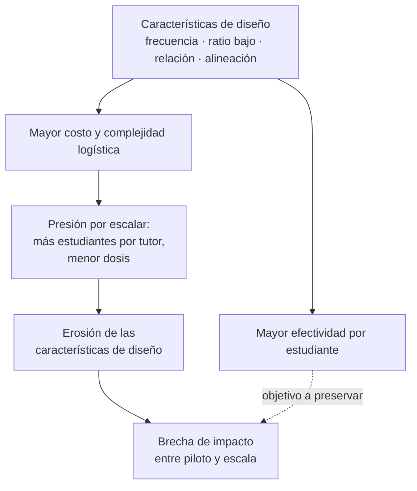

# Escalar lo que funciona sin romperlo: cinco años de investigación sobre tutoría y lo que enseñan a quien dirige tecnología

> **Fuente principal:** *Five Years of Tutoring Research: What We Have Learned Since the Pandemic*, National Student Support Accelerator (NSSA), Stanford University, 06/05/2026.
> Síntesis de investigación publicada desde 2021 sobre tutoría de alto impacto (*high-impact tutoring*).
> **Nota de método:** este artículo reorganiza y contextualiza el brief para una audiencia técnica y de transformación digital. Toda extrapolación fuera del ámbito educativo está marcada como **Análisis propio**.

---

## Por qué un brief sobre tutoría escolar le importa a quien construye sistemas

Hay un patrón que cualquiera que haya llevado una solución de un piloto a producción reconoce de inmediato: la intervención funciona espectacularmente bien con diez usuarios y un equipo dedicado, y luego pierde la mitad de su efecto cuando se extiende a diez mil. El brief de Stanford documenta exactamente ese fenómeno, pero en educación: la tutoría intensiva es una de las intervenciones con mayor evidencia para mejorar el aprendizaje, y aun así su impacto se erosiona cuando se escala dentro de las restricciones reales de los sistemas escolares.

**Según la fuente:** durante la última década, un cuerpo creciente de investigación identificó la tutoría de alto impacto como una de las estrategias más efectivas para mejorar el aprendizaje, y en años recientes la atención se desplazó de *si* la tutoría funciona hacia *cómo* operan estos programas a escala, de forma equitativa y costo-efectiva.

**Análisis propio:** para un VP de Ingeniería, un líder de operaciones o el dueño de una pyme que adopta automatización o IA, ese desplazamiento de pregunta es la lección central. El brief no es realmente sobre tutoría. Es un caso de estudio, riguroso y con datos, sobre el problema más difícil de la ejecución: **preservar las características que hacen efectiva una intervención mientras se elimina la fricción que impide escalarla.** Es el mismo problema que describen Forsgren, Humble y Kim en *Accelerate* cuando muestran que el desempeño no proviene de prácticas aisladas, sino de capacidades sostenidas dentro de un sistema.

---

## Parte 1 — Qué hace efectiva una intervención: las características de diseño

### Las tres características núcleo

**Según la fuente:** la investigación experimental y cuasi-experimental identifica de forma consistente tres rasgos que predicen la efectividad de la tutoría:

1. **Frecuencia alta** — típicamente tres o más sesiones por semana.
2. **Ratios bajos** — un tutor con uno o muy pocos estudiantes.
3. **Relaciones sostenidas** — vínculo tutor-estudiante mantenido en el tiempo.

Estos rasgos forman el núcleo de lo que el campo llama *high-impact tutoring*. La fuente añade que los efectos pueden persistir: algunos estudios documentan ganancias de aprendizaje que se mantienen varios años después de terminada la tutoría.

**Análisis propio:** conviene leer estas tres variables como las "constantes de diseño" de la intervención. No son configurables sin costo. Cuando una organización escala un servicio —sea soporte, onboarding, mentoría interna o un copiloto de IA— suele tratar la frecuencia, el ratio y la continuidad de la relación como las primeras palancas a sacrificar para reducir costo. El brief muestra que precisamente esas son las palancas que cargan el efecto.

### El compromiso fundamental: dosis y ratio frente a costo

**Según la fuente:**

- A mayor **dosis** de tutoría, mayores ganancias académicas, de forma consistente entre estudios.
- Existen estructuras alternativas para escalar: estudiantes más jóvenes pueden beneficiarse de sesiones más cortas pero más frecuentes cuando se combinan con práctica independiente estructurada en una plataforma vinculada. La dosis óptima varía según población, materia y modelo de instrucción.
- Sobre los **ratios**: la tutoría uno-a-uno suele producir las mayores ganancias, aunque la de grupo pequeño (dos a cuatro estudiantes) todavía genera resultados positivos. El análisis de las interacciones muestra que el estudiante en formato uno-a-uno recibe sustancialmente más instrucción individualizada y construcción de relación. Además, los tutores con varios estudiantes tienden a asignar más atención a los de menor desempeño.
- La **alineación curricular** importa: los estudiantes obtienen mayores ganancias cuando el contenido de la tutoría se alinea con el currículo y los estándares del aula. La evidencia empírica sobre esto es reciente.

El siguiente diagrama resume la tensión central que recorre todo el brief.



**Análisis propio — una lectura cuantitativa del compromiso.** El brief no propone una fórmula; lo que sigue es una formalización *ilustrativa* para ordenar la intuición, no un modelo derivado de la fuente. Podemos pensar la efectividad por estudiante como el producto de las características que la investigación asocia al impacto:

$$
E_{\text{estudiante}} \;\approx\; f(\text{dosis}) \cdot g(\text{ratio}) \cdot h(\text{relación}) \cdot k(\text{alineación})
$$

La utilidad de verlo así es que muestra por qué la degradación no es lineal: cuando se escala recortando varios factores a la vez (más alumnos por tutor *y* menos sesiones), las pérdidas se **multiplican**, no se suman. Es la misma no linealidad que advierte Fred Brooks en *The Mythical Man-Month* sobre la coordinación: agregar capacidad de forma ingenua puede degradar el resultado en lugar de mejorarlo.

### Tecnología en el modelo: qué dice realmente la evidencia

Esta es la sección más relevante para una audiencia que evalúa adoptar IA, y conviene reportarla con precisión porque la fuente es deliberadamente cauta.

**Según la fuente:**

| Modelo de entrega | Estado de la evidencia |
|---|---|
| Tutoría humana presencial | Base de evidencia más sólida; la mayoría de los estudios la evalúan. |
| Tutoría humana remota | Puede mejorar resultados, incluso en estudiantes jóvenes (evidencia post-pandemia). |
| Aprendizaje asistido por computadora (CAL) en solitario | Ganancias modestas; la adopción suele ser demasiado baja para producir efectos significativos, incluso en plataformas bien diseñadas. |
| Tutoría humana **con apoyo de IA** (IA asiste, no reemplaza) | Enfoque prometedor; una herramienta de IA que daba apoyo en tiempo real para corregir errores mejoró el aprendizaje, **sobre todo con tutores novatos o menos efectivos**. |
| Tutor de IA directo al estudiante | Evidencia rigurosa todavía limitada. Los sistemas de tutoría inteligente (ITS) previos muestran efectos positivos moderados. |
| Tutor de IA **con apoyo humano al lado** | Los estudiantes usan mejor la IA cuando hay un humano que aporta apoyo emocional y pedagógico. |

**Según la fuente** — dos hallazgos que conviene no suavizar:

- En un experimento reciente, emparejar a estudiantes con un tutor humano mientras usaban una plataforma de IA **aumentó sustancialmente el uso y el engagement**, pero el uso total permaneció muy por debajo de los niveles recomendados y **la intervención no produjo ganancias medibles en logro académico**.
- Lo que sí está claro de la evidencia existente: el apoyo humano incrementa el engagement y el uso productivo de la tecnología y de los tutores de IA.
- Los estudiantes que fijan **metas de aprendizaje bien definidas** interactúan con las plataformas un 25 % más de tiempo y dominan un 40 % más de habilidades, lo que sugiere que la autorregulación es crítica para determinar quién prospera con modelos autónomos.

**Análisis propio:** este es, probablemente, el insight más transferible del brief para cualquier líder que esté desplegando IA en su organización. La narrativa dominante de "IA autónoma que reemplaza al experto" no es lo que la evidencia más sólida respalda hoy. El patrón que sí aparece es **IA como amplificador del operador humano**, con dos efectos muy concretos:

- El mayor beneficio del copiloto se observó **con los operadores menos experimentados** —el novato—, no con el experto. Esto coincide con lo que empieza a verse en ingeniería de software: los asistentes de IA comprimen la curva de aprendizaje de quien está empezando más que el techo de quien ya domina.
- La tecnología desplegada en solitario sufre de **adopción insuficiente**, no de mala calidad. El cuello de botella no fue el modelo, fue que la gente no lo usó lo suficiente. Es el riesgo número uno, y silencioso, de toda iniciativa de transformación digital: comprar la capacidad y no diseñar la adopción.

> **Recomendación práctica:** al evaluar una herramienta de IA para tu equipo, separa dos preguntas que suelen confundirse: *¿el modelo es bueno?* y *¿la gente lo usará a la dosis necesaria para que importe?* El brief sugiere que la segunda pregunta es la que decide el resultado, y que el apoyo humano y la fijación explícita de metas son las palancas que la mueven.

### Más allá del resultado principal: efectos de segundo orden

**Según la fuente:** la tutoría puede influir en resultados más amplios que el logro académico inmediato. Reduciría la asignación a educación especial; los estudiantes faltan menos los días con tutoría agendada (efecto más fuerte en programas más alineados con los estándares de alto impacto: dentro de la jornada, ratios bajos, dosis alta). Las estudiantes mujeres con tutoras mujeres mostraron grandes aumentos en interés por STEM y mejores notas de matemáticas, sobre todo en formato presencial. Una actividad breve para resaltar intereses compartidos entre tutor y estudiante aumentó la asistencia. Y un ensayo aleatorizado halló mejoras en notas de matemáticas y mayor inscripción en formación vocacional más de un año después.

**Análisis propio:** el hilo conductor es que **la relación es un mecanismo causal, no un adorno**. La asistencia, el engagement y hasta la identidad profesional se mueven a través del vínculo, y el vínculo depende parcialmente del *setting* (lo presencial construye relaciones más fuertes que lo remoto). Para equipos distribuidos y operaciones remotas, esto es una advertencia con datos: lo remoto y lo presencial pueden producir resultados *técnicos* equivalentes, pero la fuerza de la relación —y por tanto la retención y el compromiso— no es neutral al formato.

---

## Parte 2 — La fuerza de trabajo: reclutar, desplegar y el problema de la escala

### Quién puede entregar la intervención

**Según la fuente:** la tutoría puede ser entregada por un rango amplio de educadores —docentes, paraprofesionales, estudiantes universitarios, voluntarios pagados y no pagados—. Los voluntarios *no pagados* muestran a menudo resultados más débiles. Sin embargo, hallazgos recientes sugieren que las **características del programa** (alcanzar umbrales de dosis, apoyar al tutor a adaptar la instrucción) pueden importar más que el tipo de tutor por sí solo. La tutoría entre pares de distinta edad produce efectos académicos pequeños a moderados, positivos tanto para el tutor como para el tutelado.

**Análisis propio:** traducido al lenguaje de operaciones, esto es una afirmación sobre **proceso sobre perfil**. La tentación al escalar es obsesionarse con contratar al perfil ideal. La evidencia sugiere que un sistema de soporte bien diseñado —entrenamiento, materiales, feedback, umbrales mínimos— eleva a operadores promedio más de lo que el perfil individual predice. Es la misma idea que recorre *Team Topologies* de Skelton y Pais: el rendimiento es una propiedad del sistema y sus interfaces, no solo de los individuos.

### Reclutamiento: el mensaje cambia la oferta

**Según la fuente:** en un estudio dirigido a estudiantes universitarios, **enfatizar los beneficios financieros** de la tutoría en los correos de reclutamiento **casi triplicó** el número de postulaciones. Los mensajes que resaltaban impacto social, desarrollo de carrera o motivaciones prosociales **no** aumentaron significativamente las postulaciones.

**Análisis propio:** el efecto es contraintuitivo y operacionalmente valioso. Para quien recluta talento técnico escaso, la lección no es "la gente solo quiere dinero", sino que **la concreción y la saliencia del mensaje superan a la narrativa aspiracional**. Daniel Kahneman, en *Thinking, Fast and Slow*, describe cómo la información concreta y disponible domina la decisión rápida. Un beneficio tangible y específico se procesa de inmediato; el "impacto social" exige una inferencia que muchos candidatos no completan al decidir si postular.

### Por qué los pilotos brillan y la escala decepciona

Este es el corazón del brief, y el punto que más directamente le habla a quien dirige transformación.

**Según la fuente:** un hallazgo recurrente es que los programas producen efectos mayores en los estudios tempranos que en las implementaciones a gran escala. Un metaanálisis reciente lo explica:

- Al expandirse, las restricciones de costo y capacidad llevan a operar con **menor dosis y ratios más altos**, lo que da cuenta de **aproximadamente un tercio** de la diferencia de impacto observada.
- La **fidelidad de implementación** puede deteriorarse al crecer, especialmente con escasez de personal o restricciones de horario.
- Las evaluaciones tempranas suelen enfocarse en los estudiantes de mayor necesidad, que tienen más margen de mejora y experimentan ganancias mayores.

**Análisis propio:** este es uno de los diagnósticos más limpios que existen sobre la brecha piloto-producción, con un número concreto. Cerca de un tercio de la pérdida de efecto **no es misterio ni mala suerte: es la consecuencia mecánica de recortar las variables de diseño bajo presión de costo.** En términos de software y operaciones, es deuda de fidelidad: cada concesión —un ratio más alto aquí, una sesión menos allá— parece marginal y reversible, pero compuesta produce un sistema que se parece al piloto solo en el nombre.

> **Recomendación práctica:** instrumenta la fidelidad como un indicador de primera clase desde el día uno del rollout, no como auditoría posterior. Si las "constantes de diseño" de tu intervención son medibles, su erosión es detectable antes de que el impacto colapse. A modo ilustrativo (**análisis propio**, pseudocódigo conceptual):

```python
# Pseudocódigo ilustrativo: monitor de fidelidad de una intervención al escalar.
# No proviene de la fuente; formaliza la idea de "deuda de fidelidad".

UMBRALES = {
    "sesiones_por_semana": 3,      # frecuencia mínima
    "ratio_max": 4,                # estudiantes por tutor
    "continuidad_min": 0.80,       # % de sesiones con el mismo tutor
    "alineacion_min": 0.70,        # % de contenido alineado al currículo
}

def fidelidad(cohorte) -> dict:
    señales = {
        "frecuencia_ok": cohorte.sesiones_por_semana >= UMBRALES["sesiones_por_semana"],
        "ratio_ok":      cohorte.ratio <= UMBRALES["ratio_max"],
        "relacion_ok":   cohorte.continuidad >= UMBRALES["continuidad_min"],
        "alineacion_ok": cohorte.alineacion >= UMBRALES["alineacion_min"],
    }
    en_riesgo = [k for k, ok in señales.items() if not ok]
    return {"saludable": not en_riesgo, "factores_en_riesgo": en_riesgo}

# Alertar cuando una cohorte deja de parecerse al piloto, antes de medir el resultado final.
```

### Confianza sostenida en el campo

**Según la fuente:** los datos de encuesta indican confianza amplia y sostenida. En el ciclo 2024-25, el 42 % de las escuelas públicas reportó ofrecer tutoría de alta dosis, y de ellas el 91 % la calificó como moderada, muy o extremadamente efectiva. Alrededor de un tercio de los directores la señaló como su primera prioridad de financiamiento adicional, y cerca del 80 % de quienes la ofrecían mantuvieron o ampliaron la cobertura aun con la caída del financiamiento federal de recuperación. En una encuesta nacional a 23.000 padres, el 86 % se declaró a favor de tutoría gratuita para estudiantes por debajo del nivel de grado.

**Limitación:** estos son datos de percepción y de auto-reporte (efectividad percibida, intención de financiamiento), no mediciones causales de logro. La fuente los presenta como evidencia de respaldo y sostenibilidad institucional, no como prueba de efecto. Conviene leerlos así.

---

## Parte 3 — Las condiciones que habilitan: implementación y participación

**Según la fuente:** pasar de la evidencia a la implementación consistente requiere **integrar la tutoría en los sistemas escolares existentes, no construir estructuras paralelas.**

### Liderazgo e infraestructura

**Según la fuente:** las escuelas identifican dos restricciones estructurales como barreras: conseguir espacio físico y agendar las sesiones dentro de la jornada sin interrumpir la instrucción central. Las escuelas que designan bloques dedicados en el horario maestro y reciben apoyo administrativo logran sostener mejor los programas. Herramientas recientes de programación de horarios asistidas por IA han emergido como solución a la complejidad del *master scheduling*. La fuente subraya además el rol del director comprometido y la figura del "campeón de la tutoría" (un docente líder que gestiona la logística), y señala los **contratos basados en resultados** (*outcomes-based contracting*) como estrategia para alinear incentivos entre distritos y proveedores.

**Análisis propio:** este apartado es casi un manual de transformación digital sin decirlo.

- **No construir sistemas paralelos** es exactamente la advertencia contra las soluciones "isla" que no se integran en el flujo de trabajo existente y mueren por fricción.
- El **horario maestro** es un problema de asignación de recursos restringido —el tipo de problema en el que la optimización asistida por IA aporta valor real— y la fuente lo señala explícitamente como un punto donde la tecnología ayuda.
- El **"campeón"** es la figura del *owner* o sponsor ejecutivo: sin alguien con autoridad que sostenga la logística, la iniciativa se trata como periférica y se degrada.
- Los **contratos basados en resultados** son la versión institucional de alinear incentivos por *outcome*, no por *output*: pagar por el resultado entregado, no por horas o licencias. Es un principio que *Accelerate* y la lógica DORA aplican al rendimiento de software.

### Participación: el filtro que casi nadie mide

**Según la fuente** — y es quizá el hallazgo más incómodo del brief:

- Cuando se ofrece tutoría gratuita, bajo demanda y con inscripción voluntaria (*opt-in*), **la gran mayoría de los estudiantes no se inscribe** y por tanto no recibe el servicio. Peor aún: **los estudiantes con mayor necesidad académica suelen ser los menos propensos a participar.**
- La participación familiar importa: un aumento de una desviación estándar en el involucramiento de la familia se asoció con unas **10 horas adicionales** de tutoría. Las familias valoran no solo el apoyo académico sino el desarrollo socioemocional.
- La tutoría fuera de la jornada reduce la presión de horario pero enfrenta problemas de asistencia ligados a transporte y agendas familiares.

**Análisis propio:** aquí hay una de las trampas más caras de cualquier despliegue, y el brief la documenta con datos. **Un recurso valioso, gratuito y disponible no genera valor si el modelo de acceso es opt-in y la población objetivo es justo la que no opta.** El diseño "lo ponemos disponible para quien lo quiera" produce una inequidad estructural: capta a quien menos lo necesita y deja fuera a quien más lo necesitaría.

> **Recomendación práctica:** para cualquier capacidad nueva —una herramienta interna, un programa de mejora, un copiloto de IA— audita el **modelo de acceso** con la misma seriedad que la capacidad misma. Si la adopción es voluntaria y sin fricción reducida, mide *quién* la adopta, no solo *cuántos*. El default importa: un recurso integrado en el flujo (opt-out, dentro de la jornada, sin barreras de transporte) llega a quien un modelo opt-in jamás alcanza.

---

## Síntesis para quien decide: del brief a la ejecución

La siguiente tabla traduce los hallazgos de la fuente a principios accionables. La columna de la izquierda es **según la fuente**; la de la derecha es **análisis propio** dirigido a contextos de tecnología, operaciones y transformación digital.

| Hallazgo (educación, según la fuente) | Principio transferible (análisis propio) |
|---|---|
| Frecuencia, ratio bajo y relación sostenida cargan el efecto. | Identifica las "constantes de diseño" de tu intervención y protégelas; son las primeras que se sacrifican al recortar costo. |
| ~⅓ de la brecha piloto-escala viene de menor dosis y ratios más altos. | La degradación al escalar no es accidente: instrumenta y vigila la fidelidad como métrica de primera clase. |
| La IA en solitario sufre de baja adopción, no de baja calidad. | Separa "¿la herramienta es buena?" de "¿se usará a la dosis que importa?"; diseña la adopción, no solo la capacidad. |
| El copiloto de IA beneficia más al operador novato. | La IA comprime la curva del principiante más que el techo del experto; prioriza ese caso de uso. |
| El apoyo humano y las metas explícitas elevan el uso productivo de la IA. | Empareja humano + tecnología y fija metas concretas; la autonomía total rinde menos hoy. |
| Mensaje financiero concreto casi triplicó el reclutamiento. | En captación, la concreción y saliencia superan a la narrativa aspiracional. |
| El proceso de soporte importa más que el perfil del tutor. | Invierte en sistema (entrenamiento, materiales, feedback) antes que en buscar el perfil perfecto. |
| Integrar en estructuras existentes, no construir paralelas. | Evita soluciones isla; intégralas en el flujo de trabajo y el horario reales. |
| El opt-in deja fuera a quien más lo necesita. | Audita el modelo de acceso; el *default* y la reducción de fricción deciden la equidad del resultado. |
| Contratos basados en resultados alinean incentivos. | Paga y mide por *outcome*, no por *output*. |

---

## Conclusión

El brief de Stanford se lee, en su superficie, como una revisión de cinco años de investigación educativa. Leído con ojos de ingeniería y operaciones, es algo más útil: una de las descripciones mejor documentadas que existen del problema de **escalar una intervención eficaz sin destruir lo que la hacía eficaz.**

La intervención funciona cuando preserva sus características de diseño. Se degrada cuando la presión de costo erosiona esas características una concesión marginal a la vez. La tecnología ayuda sobre todo como amplificador del operador humano, no como su reemplazo, y su mayor riesgo no es la calidad sino la adopción. Y nada de esto importa si el modelo de acceso deja fuera a la población que debía beneficiarse.

**Análisis propio — la idea de cierre:** la madurez de una organización no se mide por su capacidad de diseñar buenas intervenciones en pequeño, sino por su disciplina para sostenerlas en grande. Esa disciplina es medible. Empieza por nombrar las constantes que no se negocian, instrumentar su erosión y diseñar la adopción con la misma seriedad que la capacidad. El piloto que brilla es barato. El sistema que conserva ese brillo a escala es el verdadero entregable.

---

### Fuente

- National Student Support Accelerator, Stanford University. *Five Years of Tutoring Research: What We Have Learned Since the Pandemic* (06/05/2026). Disponible en: https://nssa.stanford.edu/briefs/five-years-tutoring-research

### Referencias de respaldo conceptual

Usadas como andamiaje de marcos, no como autoridad sobre afirmaciones específicas:

- Forsgren, N.; Humble, J.; Kim, G. *Accelerate* — capacidades sistémicas y medición por resultados.
- Brooks, F. *The Mythical Man-Month* — no linealidad de la coordinación al añadir capacidad.
- Skelton, M.; Pais, M. *Team Topologies* — el rendimiento como propiedad del sistema y sus interfaces.
- Kahneman, D. *Thinking, Fast and Slow* — saliencia y concreción en la decisión rápida.

---

*Nota de transparencia: las secciones marcadas como **Análisis propio**, **Recomendación práctica** y **Limitación** representan interpretación y extrapolación del autor a contextos de tecnología y operaciones, y no deben atribuirse al brief de Stanford. Las afirmaciones marcadas como **Según la fuente** corresponden al contenido del documento original.*

---

Gracias por leer mi publicación. Recibo con mucho agrado los comentarios y las críticas constructivas.

Me pueden encontrar en IG @arnulfo.
