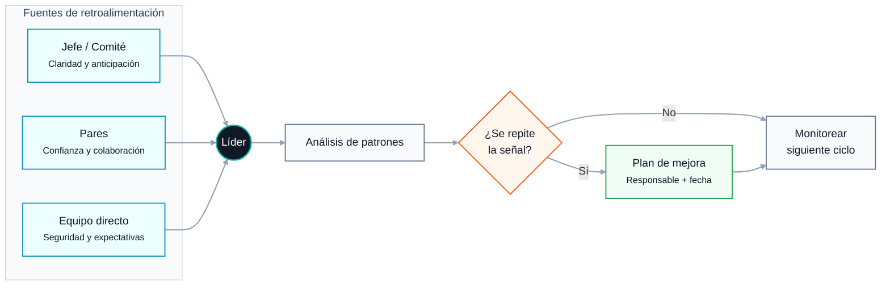

# Liderazgo 360

## Introducción

La temporada de revisiones de desempeño expone una asimetría incómoda: dedicamos semanas a evaluar a otros, pero rara vez aplicamos la misma rigurosidad a nuestro propio liderazgo. Mike Fisher, en su artículo *How Do You Know If You're a Good Leader?*, plantea esta tensión con un ejemplo histórico inesperado: la *Meditation on the Divine Will* que Abraham Lincoln escribió en septiembre de 1862, un texto privado donde admitía sus dudas, sus límites de comprensión y la posibilidad de estar equivocado.

Para un líder técnico —ya sea un Tech Lead, un VP de Ingeniería, un gerente de operaciones o el dueño de una empresa de software— este planteamiento es directamente aplicable. La efectividad del liderazgo se experimenta indirectamente, a través de otras personas, lo que hace que la autoevaluación sea simultáneamente esencial e incómoda. Este artículo traduce las ideas centrales del texto de Fisher a un marco práctico para equipos de tecnología, desarrollo y operaciones.

## Contexto del Problema

En entornos técnicos, el liderazgo suele medirse con métricas operativas: velocidad de entrega, *uptime*, cumplimiento de *roadmap*, número de incidentes. Estas métricas son necesarias, pero insuficientes. Capturan el **qué** del equipo, no el **cómo** del líder.

Fisher identifica un problema central: muchos líderes interpretan la duda como evidencia de fracaso. Asumen que un buen líder no debería sentirse incierto. Esta creencia, aplicada al contexto técnico, produce patrones reconocibles:

- Tech Leads que evitan pedir retroalimentación porque temen que su equipo cuestione su autoridad técnica.
- Gerentes de operaciones que confunden firmeza con competencia y suprimen señales débiles del equipo.
- Líderes de transformación digital que asumen que su visión es correcta porque nadie la contradice en las reuniones.
- Fundadores que evalúan rigurosamente a su equipo de ingeniería pero nunca se someten a un proceso equivalente.

El resultado es un punto ciego organizacional: el líder se convierte en el único nodo del sistema sin instrumentación adecuada.

## Análisis Técnico: Un Marco de Evaluación Multiángulo

Fisher propone que el liderazgo se mide desde al menos tres perspectivas distintas. Mi interpretación es que estas perspectivas funcionan como **tres fuentes de datos independientes** que un líder debería instrumentar de forma deliberada, igual que se instrumenta un sistema productivo.

### Las tres fuentes de señal

- **Managing up (hacia arriba):** Cómo te experimenta tu jefe o el comité directivo. ¿Generas claridad o ruido? ¿Levantas problemas temprano o los escondes hasta que explotan? ¿Eres una fuente de apalancamiento o de sorpresas?
- **Managing sideways (lateral):** Cómo te experimentan tus pares. ¿Colaboran contigo cuando es inconveniente? ¿La gente siente alivio o fricción al ver tu nombre en una invitación de reunión?
- **Managing down (hacia el equipo):** Cómo te experimenta tu equipo. ¿Sienten seguridad para decirte la verdad? ¿Entienden qué significa "buen trabajo"? ¿Salen de las interacciones contigo más claros o más confundidos?

### Diagrama del modelo

### Cómo instrumentar la retroalimentación

Inspirado en el principio de Fisher de hacer un 360 aunque nadie lo exija, y aplicando lógica de gestión de datos, propongo el siguiente flujo:

- **Recolección estructurada:** un cuestionario anual o semestral a 6–10 personas representativas de los tres ángulos. Preguntas abiertas, anónimas, con foco en comportamientos observables, no en personalidad.
- **Almacenamiento y categorización:** las respuestas se agrupan por tema (comunicación, toma de decisiones, delegación, manejo de conflictos, claridad técnica). Una hoja de cálculo simple o una herramienta como Notion, Airtable o un cuaderno privado es suficiente.
- **Detección de patrones:** Fisher es explícito en un punto crítico: *un comentario es ruido; cinco observaciones similares son señal*. Establece un umbral mínimo para distinguir señal de anécdota.
- **Acción documentada:** cada señal validada se traduce en un compromiso con responsable (tú), fecha de revisión y un indicador observable de progreso.

Esta lógica es esencialmente la misma que aplicamos a sistemas: recolectar, normalizar, detectar anomalías recurrentes, actuar. La diferencia es que el sistema observado eres tú.

## Aplicación en Entornos Reales

El marco se traduce de forma natural a varios contextos técnicos y operativos:

- **Equipos de desarrollo de software:** complementar las retrospectivas de sprint con una retro periódica enfocada en el liderazgo del Tech Lead o EM. Las retrospectivas tradicionales evalúan el proceso; esta evalúa al líder.
- **Operaciones y soporte:** revisar cómo el gerente de operaciones gestiona incidentes, comunica decisiones bajo presión y protege al equipo del ruido externo. Una encuesta corta post-incidente puede capturar estas señales.
- **Liderazgo de proyectos de transformación digital:** stakeholders, sponsors y equipo técnico raramente comparten una misma percepción del líder. El 360 expone esa desalineación antes de que se traduzca en retrasos o resistencia.
- **Dueños de empresa pequeñas y medianas:** en organizaciones donde no existe un proceso formal de RR. HH., el líder es el único capaz de iniciar su propia evaluación. Ignorar este paso suele correlacionarse con alta rotación y decisiones desconectadas de la realidad operativa.
- **Equipos remotos o distribuidos:** la ausencia de señales informales (lenguaje corporal, conversaciones de pasillo) hace que los patrones se acumulen invisiblemente. La retroalimentación estructurada compensa esa pérdida.

Vale la pena conectar esto con literatura de liderazgo e innovación. *An Elegant Puzzle* de Will Larson y *The Manager's Path* de Camille Fournier desarrollan la idea de que el liderazgo técnico es un oficio aprendible, no un rasgo innato. *Radical Candor* de Kim Scott formaliza cómo dar y recibir retroalimentación sin caer en la agresión ni en la condescendencia. *Extreme Ownership* de Jocko Willink refuerza el punto que Fisher destaca: **una vez que la retroalimentación es entregada, la responsabilidad se transfiere al receptor**. Y *Good to Great* de Jim Collins, con su concepto de líder de Nivel 5, describe exactamente el perfil que Lincoln encarna: humildad personal combinada con voluntad profesional.

## Riesgos, Límites y Consideraciones

Ningún proceso de autoevaluación es neutral. Es honesto reconocer sus limitaciones:

- **Sesgo de muestra:** si seleccionas a las 6 personas que más te aprecian, los datos serán reconfortantes pero inútiles. La diversidad de fuentes es condición de validez.
- **Sesgo de recencia:** la retroalimentación suele estar dominada por eventos de las últimas 4–6 semanas. Considera promediar varias rondas a lo largo del año.
- **Reacción defensiva:** Fisher es claro: discutir la intención no cambia el impacto. Si una percepción existe, algo la generó. La defensa argumental es el principal mecanismo que invalida el proceso.
- **Confidencialidad:** sin anonimato real, la retroalimentación se autocensura. Para equipos pequeños, esto exige usar un intermediario neutral o herramientas externas.
- **Costo de tiempo:** un 360 informal bien hecho consume entre 4 y 8 horas a lo largo de un trimestre, sumando recolección, análisis y planificación.
- **Trampa del perfeccionismo:** el objetivo no es eliminar defectos, sino reconocerlos temprano y trabajarlos deliberadamente. Fisher subraya que los líderes más dañinos no son los que tienen carencias, sino los que se niegan a reconocerlas.

## Conclusión

La aportación central del artículo de Fisher, traducida al contexto técnico, es esta: el liderazgo se mide indirectamente, a través de la experiencia de otros, y eso obliga a construir un sistema deliberado de observación de uno mismo. La confianza no es lo mismo que la competencia. La introspección no es lo mismo que la debilidad. Y la duda, bien gestionada, no es síntoma de fracaso, sino evidencia de que el rol se está tomando con la seriedad que merece.

Para un líder técnico o de operaciones, el siguiente paso es concreto y barato: **diseñar un 360 propio, recolectar señales de los tres ángulos, identificar patrones y comprometerse con uno o dos cambios medibles antes del próximo ciclo de revisión**. No requiere presupuesto, herramientas nuevas ni aprobación. Solo requiere la disposición —parafraseando a Lincoln vía Fisher— de hacer la pregunta más difícil antes que las fáciles: no *"¿soy lo suficientemente confiado?"*, sino *"¿estoy siendo honesto conmigo mismo?"*.

Esa es, en última instancia, la primera línea de instrumentación de cualquier sistema de liderazgo bien diseñado.

Gracias por leer mi publicación. Recibo con mucho agrado los comentarios y las críticas constructivas.

Me pueden encontrar en IG @arnulfo.
